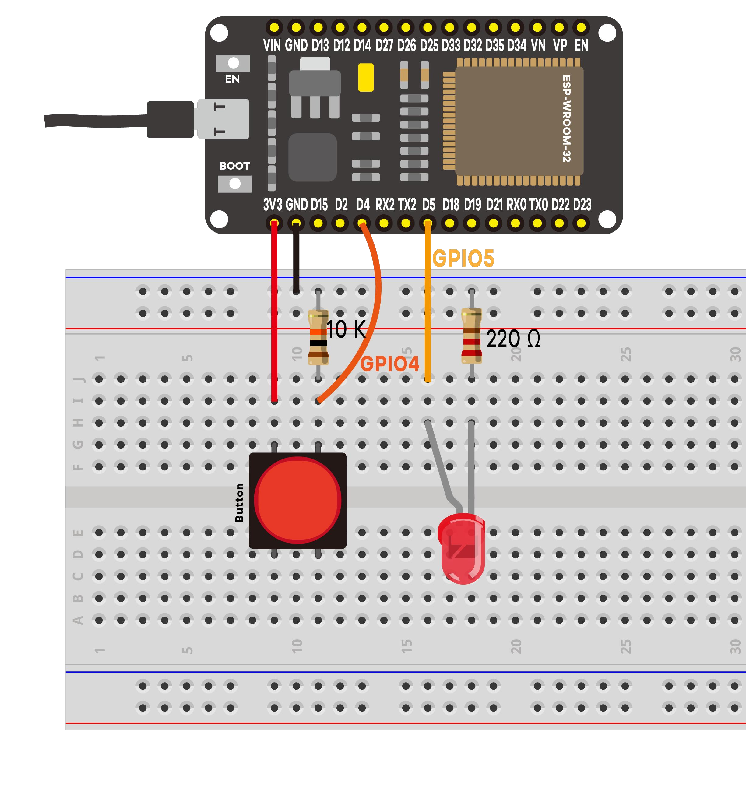

# Project #1 - Blinky

Simple project with a pushbutton and an LED.



List of the parts:
- ESP32 DEVKIT
- 5mm LED
- 220 Ohm resistor
- Pushbutton
- 10k Ohm resistor
- Breadboard
- Jumper wires

```C
const int buttonPin = 4;
const int ledPin = 5;
int buttonState = 0;

void setup() {
  Serial.begin(115200);
  pinMode(buttonPin, INPUT);
  pinMode(ledPin, OUTPUT);

}

void loop() {
  buttonState = digitalRead(buttonPin);
  Serial.println(buttonState);

  if (buttonState == HIGH) {
    digitalWrite(ledPin, HIGH);
  } else {
    digitalWrite(ledPin, LOW);
  }

}
```