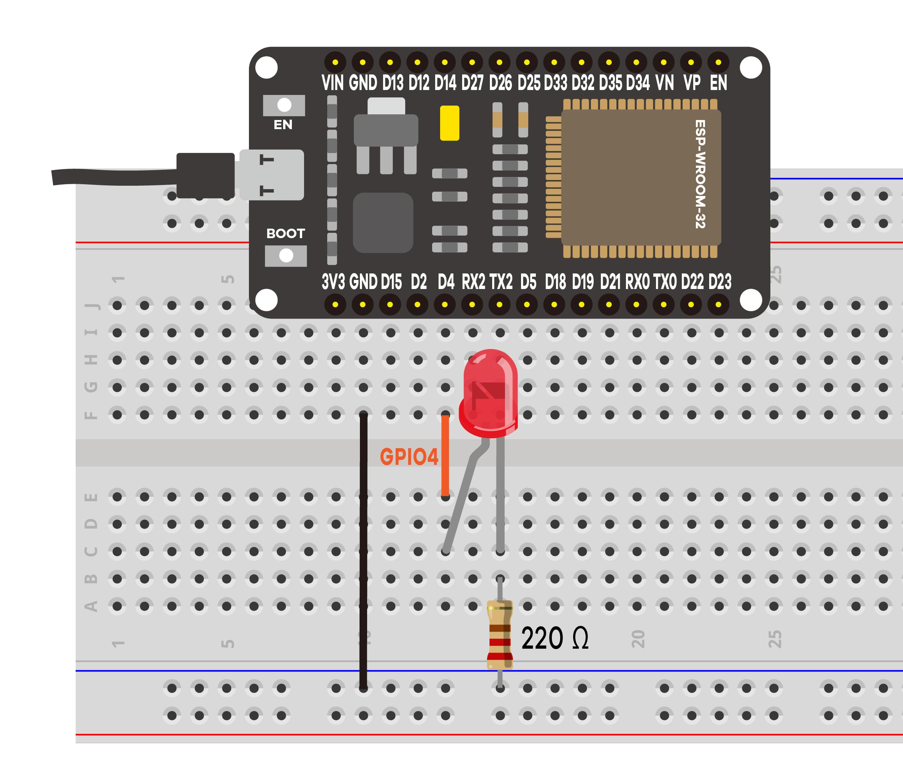

# Project #3 - PWM Analog Output

Using the PWM protocol to increase/decrease the LED brightness with a resolution of 8 bits and a frequency of 5 Khz.



The list of parts:
- ESP32
- 5mm LED
- 220 Ohm resistor
- Breadbord
- Jumper wires

```
# arduino code

const int ledPin = 4;
const int freq = 5000;
const int ledChannel = 0;
const int resolution = 8;

void setup(){
  ledcSetup(ledChannel, freq, resolution);
  ledcAttachPin(ledPin, ledChannel);
}

void loop(){
  for(int dutyCycle = 0; dutyCycle <= 255; dutyCycle++){
    ledcWrite(ledChannel, dutyCycle);
    delay(15);
  }

  for(int dutyCycle = 255; dutyCycle >= 0; dutyCycle--){
    ledcWrite(ledChannel, dutyCycle);
    delay(15);
  }
}
```