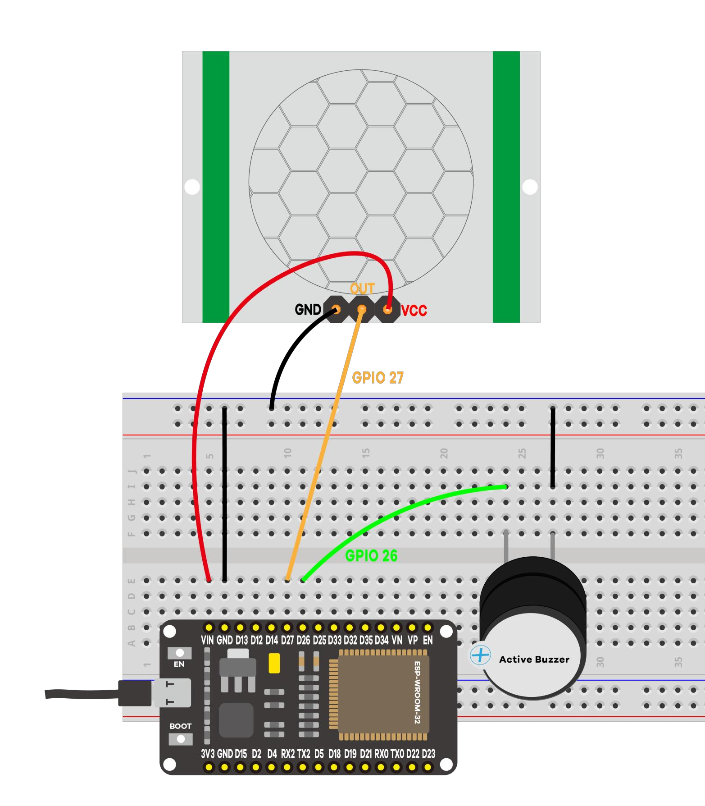

# Project #4 - PIR Motion Sensor

When motion is detected the buzzer will sound an alarm.



The list of parts:
- ESP32
- PIR motion sensor (HC-SR501)
- Active Buzzer
- Jumper wires
- Breadboard

```
# arduino code

const int buzzerPin =  26;
const int motionSensor = 27;


unsigned long previousMillis = 0;
unsigned long currentMillis;
const long interval = 3000;

void setup() {
   Serial.begin(115200);
  // set the digital pin as output:
  pinMode(buzzerPin, OUTPUT);
  pinMode(motionSensor, INPUT);
}

void loop() 
{
  int reading = digitalRead(motionSensor);
  if (reading == HIGH)
  {digitalWrite(buzzerPin,HIGH);
   Serial.println("Motion detected!Buzzer alarm!");
   previousMillis = millis();
  }
  else{
  currentMillis = millis();
   if (currentMillis - previousMillis >= interval) 
   {
    digitalWrite(buzzerPin, LOW);
    Serial.println("Motion detected!Buzzer stop alarm!");
    }
  }
}


```