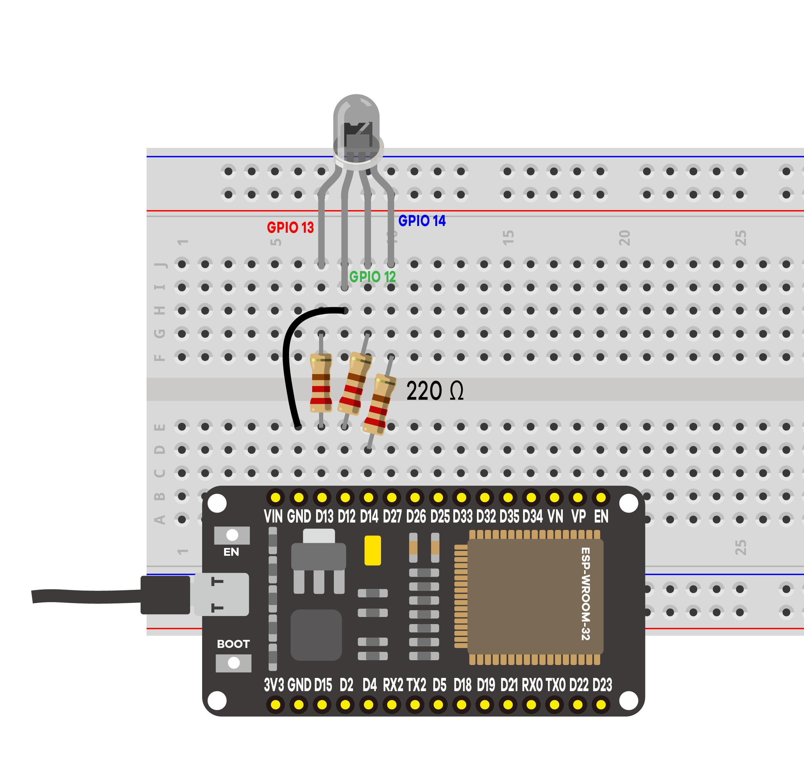

# Project #6 - RGB LED Web Server

Creating a web sever to change the color of a RGB LED. The web server must be mobile responsive and can be accessed with any device that as a browser on the local network.



List of parts:
- ESP32c3
- RGB LED
- 3 x 220 Ohm resistors
- Jumper wires
- Breadbord

```
// arduino code

// Load Wi-Fi library
#include <WiFi.h>

// Replace with your network credentials
const char* ssid = "REPLACE_WITH_YOUR_SSID";
const char* password = "REPLACE_WITH_YOUR_PASSWORD";
// Set web server port number to 80
WiFiServer server(80);

// Decode HTTP GET value
String redString = "0";
String greenString = "0";
String blueString = "0";
int pos1 = 0;
int pos2 = 0;
int pos3 = 0;
int pos4 = 0;

// Variable to store the HTTP req  uest
String header;

// Red, green, and blue pins for PWM control
const int redPin = 13;     // 13 corresponds to GPIO13
const int greenPin = 12;   // 12 corresponds to GPIO12
const int bluePin = 14;    // 14 corresponds to GPIO14

// Setting PWM frequency, channels and bit resolution
const int freq = 5000;
const int redChannel = 0;
const int greenChannel = 1;
const int blueChannel = 2;
// Bit resolution 2^8 = 256
const int resolution = 8;

// Current time
unsigned long currentTime = millis();
// Previous time
unsigned long previousTime = 0; 
// Define timeout time in milliseconds (example: 2000ms = 2s)
const long timeoutTime = 2000;

void setup() {
  Serial.begin(115200);
  // configure LED PWM functionalitites
  ledcSetup(redChannel, freq, resolution);
  ledcSetup(greenChannel, freq, resolution);
  ledcSetup(blueChannel, freq, resolution);
  
  // attach the channel to the GPIO to be controlled
  ledcAttachPin(redPin, redChannel);
  ledcAttachPin(greenPin, greenChannel);
  ledcAttachPin(bluePin, blueChannel);
  
  // Connect to Wi-Fi network with SSID and password
  Serial.print("Connecting to ");
  Serial.println(ssid);
  WiFi.begin(ssid, password);
  while (WiFi.status() != WL_CONNECTED) {
    delay(500);
    Serial.print(".");
  }
  // Print local IP address and start web server
  Serial.println("");
  Serial.println("WiFi connected.");
  Serial.println("IP address: ");
  Serial.println(WiFi.localIP());
  server.begin();
}

void loop(){
  WiFiClient client = server.available();   // Listen for incoming clients

  if (client) {                             // If a new client connects,
    currentTime = millis();
    previousTime = currentTime;
    Serial.println("New Client.");          // print a message out in the serial port
    String currentLine = "";                // make a String to hold incoming data from the client
    while (client.connected() && currentTime - previousTime <= timeoutTime) {            // loop while the client's connected
      currentTime = millis();
      if (client.available()) {             // if there's bytes to read from the client,
        char c = client.read();             // read a byte, then
        Serial.write(c);                    // print it out the serial monitor
        header += c;
        if (c == '\n') {                    // if the byte is a newline character
          // if the current line is blank, you got two newline characters in a row.
          // that's the end of the client HTTP request, so send a response:
          if (currentLine.length() == 0) {
            // HTTP headers always start with a response code (e.g. HTTP/1.1 200 OK)
            // and a content-type so the client knows what's coming, then a blank line:
            client.println("HTTP/1.1 200 OK");
            client.println("Content-type:text/html");
            client.println("Connection: close");
            client.println();
                   
            // Display the HTML web page
            client.println("<!DOCTYPE html><html>");
            client.println("<head><meta name=\"viewport\" content=\"width=device-width, initial-scale=1\">");
            client.println("<link rel=\"icon\" href=\"data:,\">");
            client.println("<link rel=\"stylesheet\" href=\"https://stackpath.bootstrapcdn.com/bootstrap/4.3.1/css/bootstrap.min.css\">");
            client.println("<script src=\"https://cdnjs.cloudflare.com/ajax/libs/jscolor/2.0.4/jscolor.min.js\"></script>");
            client.println("</head><body><div class=\"container\"><div class=\"row\"><h1>ESP Color Picker</h1></div>");
            client.println("<a class=\"btn btn-primary btn-lg\" href=\"#\" id=\"change_color\" role=\"button\">Change Color</a> ");
            client.println("<input class=\"jscolor {onFineChange:'update(this)'}\" id=\"rgb\"></div>");
            client.println("<script>function update(picker) {document.getElementById('rgb').innerHTML = Math.round(picker.rgb[0]) + ', ' +  Math.round(picker.rgb[1]) + ', ' + Math.round(picker.rgb[2]);");
            client.println("document.getElementById(\"change_color\").href=\"?r\" + Math.round(picker.rgb[0]) + \"g\" +  Math.round(picker.rgb[1]) + \"b\" + Math.round(picker.rgb[2]) + \"&\";}</script></body></html>");
            // The HTTP response ends with another blank line
            client.println();

            // Request sample: /?r201g32b255&
            // Red = 201 | Green = 32 | Blue = 255
            if(header.indexOf("GET /?r") >= 0) {
              pos1 = header.indexOf('r');
              pos2 = header.indexOf('g');
              pos3 = header.indexOf('b');
              pos4 = header.indexOf('&');
              redString = header.substring(pos1+1, pos2);
              greenString = header.substring(pos2+1, pos3);
              blueString = header.substring(pos3+1, pos4);
              /*Serial.println(redString.toInt());
              Serial.println(greenString.toInt());
              Serial.println(blueString.toInt());*/
              ledcWrite(redChannel, redString.toInt());
              ledcWrite(greenChannel, greenString.toInt());
              ledcWrite(blueChannel, blueString.toInt());
            }
            // Break out of the while loop
            break;
          } else { // if you got a newline, then clear currentLine
            currentLine = "";
          }
        } else if (c != '\r') {  // if you got anything else but a carriage return character,
          currentLine += c;      // add it to the end of the currentLine
        }
      }
    }
    // Clear the header variable
    header = "";
    // Close the connection
    client.stop();
    Serial.println("Client disconnected.");
    Serial.println("");
  }
}
```