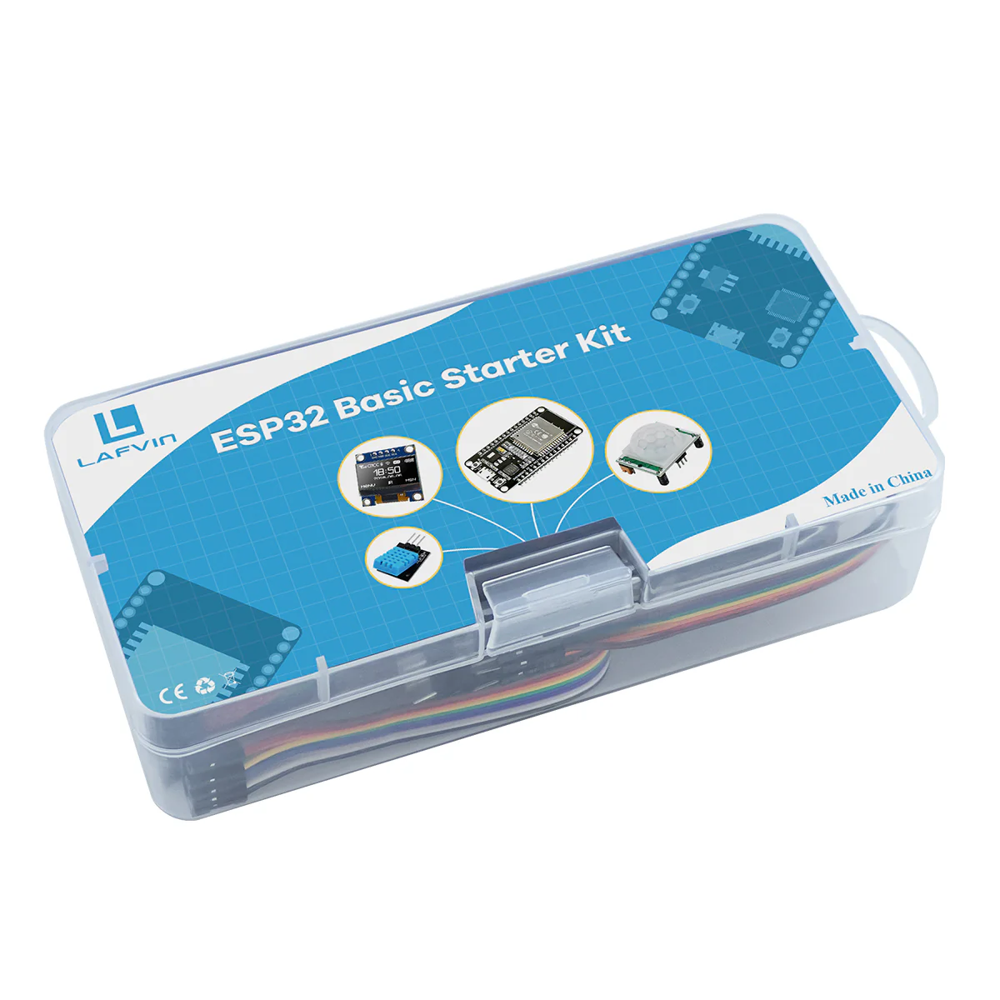

# Rust on ESP32

I purchased a basic ESP32 starter kit created by Lafvin with the plan to build each of the 10 projects with Rust instead of Arduino as the documentation calls for. This kit provides an ESP32-WROOM-32 and I also bought an ESP32c3-DevKitm-1 to practice on 2 different microcontroller architecture (xtensa et RISC-V respectively).

Bare-programming with Arduino is easier than with Rust because of the abstraction layers offers by the sdk but Rust gives us more power to handle the bare-metal with high-level programing style even if it is more verbose.

For each project, I provide a breadboard schema, a list of components and the arduino code (perhaps I gona upload videos of the finish projects).



## Projects

Here is the list of projects:

[Project_0](./project_0/) - Hello World + Blinky

The first simple project when one begins in bare-metal programming.

```
target = ESP32
type = no_std
```

[Project_1](./project_1/) - Blinky

Simple project with a pushbutton and an LED.

```
target = ESP32
type = no_std
```

[Project_2](./project_2/) - Analog Inputs (ADC)

Reading an analog voltage value varying between 0V and 3.3V. The voltage measured is then assigned to a value between 0 (0V) and 4095 (3.3V) because the value has 12-bit resolution.

```
target = ESP32
type = no_std
```


[Project_3](./project_3/) - PWM Analog Output

Using the PWM protocol to increase/decrease the LED brightness with a resolution of 12 bits and a frequency of 4 Khz.

```
target = ESP32
type = no_std
```


[Project_4](./project_4/) - PIR Motion Sensor

When motion is detected the buzzer will sound an alarm during 500 milliseconds.

```
target = ESP32
type = no_std
```


[Project_5](./project_5/) - Switch Web Server

Creating a standalone web server that controls (outputs) two Leds. The web server must be mobile responsive and can be accessed with any device that as a browser on the local network.

```
target = ESP32
type = std
```

[Project_6](./project_6/) - RGB LED Web Server

Creating a web sever to change the color of a RGB LED. The web server must be mobile responsive and can be accessed with any device that as a browser on the local network.

```
target = ESP32c3
type = std
```

[Project_7](./project_7/) - Relay Web Server

Creating a web server to control electrical appliances remotely thanks to a relay. Abviously, the web server must be responsive and accessible from any device.

```
target = ESP32c3
type = std
```

Project_8 - Output State Synchronization Web Server

Project_9 - DHT11 Web Server

Project_10 - OLED Display


